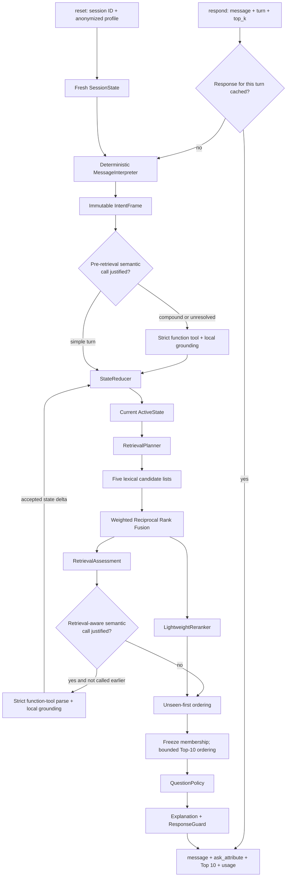

# Shopping Copilot Technical Architecture

This document describes the code that exists in the final submission package.
It does not describe aspirational components. Remaining work and alternative
implementations are centralized in [`../TODO.md`](../TODO.md).
For the same design organized by classes, ownership, protocols, and data
objects, see [`class-diagrams.md`](class-diagrams.md).

## 1. Objective and constraints

The agent must place one hidden frozen-catalog `parent_asin` in the first ten
valid unique recommendations, at the highest possible rank and earliest possible
turn. It may ask one structured clarification and recommend on the same turn.
The session ends on a hit or after turn 10.

Design consequences:

- every usable turn returns recommendations;
- current session evidence outranks the anonymized Customer Profile;
- corrections remove stale evidence before retrieval;
- missing catalog metadata is unknown, not a contradiction;
- optional model failure cannot break the offline path; and
- only `ResponseGuard` creates the organizer-facing response.

## 2. Submission layout

```text
submission/
|-- agent.py                         Canonical organizer-facing Agent
|-- requirements.txt                Python 3.10+, standard-library runtime
|-- README.md                        Reproduction instructions
`-- src/
    |-- agent.py                     End-to-end ShoppingAgent coordinator
    |-- config.py                    Frozen AgentConfig and tuning rationale
    |-- contracts.py                 Provider protocols and ResponseGuard
    |-- environment.py               Allow-listed .env loader
    |-- catalog/
    |   |-- attributes.py            Catalog-derived attribute registry
    |   |-- models.py                Normalized product records
    |   |-- normalization.py         Unicode/text normalization
    |   `-- store.py                 Product map and in-memory SQLite FTS5
    |-- understanding/
    |   |-- models.py                IntentFrame and SlotUpdate
    |   |-- contextual.py            Short-answer resolution
    |   |-- interpreter.py           Deterministic message parser
    |   |-- escalation.py            Retrieval-aware model-call policy
    |   |-- semantic.py              Responses-compatible API adapter
    |   `-- semantic_grounding.py    Local model-output validation
    |-- dialog/
    |   |-- models.py                ActiveState and SessionState
    |   |-- reducer.py               State transitions and overrides
    |   |-- store.py                 Thread-safe session lifecycle
    |   `-- policy.py                Clarification value policy
    |-- retrieval/
    |   |-- models.py                Plan, evidence, and assessment types
    |   |-- planner.py               Focused/exploratory route blend
    |   |-- lexical.py               Five candidate generators
    |   `-- fusion.py                Weighted RRF and overlap assessment
    `-- ranking/
        |-- budget.py                Three-valued price evidence
        |-- reranker.py              Inspectable final score
        |-- exposure.py              Across-turn novelty
        |-- ordering.py              Frozen-membership Top-10 ordering
        `-- explanations.py          Evidence-grounded response text
```

`starter/agent.py` is intentionally a one-line compatibility import because the
supplied evaluator imports `starter.agent.Agent`. Product logic belongs only in
`submission/`.

## 3. End-to-end decision loop



The optional semantic parser has two mutually exclusive gates per turn. A
pre-retrieval gate handles compound corrections or unresolved language before
state mutation. If it skips, a retrieval-aware gate can still react to unstable
candidates. At most one provider request occurs per turn. It cannot return IDs,
and any failure preserves the complete deterministic path.

## 4. Catalog ingestion and missing fields

`CatalogStore` reads the frozen JSONL file once. Each line must contain a unique,
non-empty `parent_asin`; invalid identity fails fast. Other fields are normalized
as follows:

| Input field | Runtime representation when missing |
|---|---|
| Text scalar | Empty string |
| Text list/mapping | Empty tuple |
| `price`, `average_rating` | `None` |
| `rating_number` | `0` |

The store builds an in-memory SQLite FTS5 table with the column order
`parent_asin, title, categories, features, details, store, description`.
`parent_asin` is unindexed. Four BM25 weight vectors emphasize all fields,
titles, categories, or constraint-bearing metadata. The field-weighted route is
kept as an independently measurable reliable baseline inside the ensemble.

`CatalogAttributeRegistry` derives values from catalog detail keys, stores,
categories, and short feature terms. It supplies:

- exact normalized value-to-attribute evidence;
- per-product representative values for question partitioning;
- catalog coverage/repetition priors for answerability; and
- log-space price quantiles at 10%, 25%, 50%, 75%, and 90%.

Package dimensions are excluded from wearable-size evidence. Unstructured or
missing values remain searchable text but do not become false typed facts.

## 5. Message interpretation

`MessageInterpreter` receives one message and the immediately preceding
`ask_attribute`. It returns an immutable `IntentFrame`; it never mutates session
state.

Deterministic parsing order:

1. detect correction/override language;
2. detect one or more explicit/contextual no-preference fields and remove those
   spans before positive parsing;
3. extract a leading requested category;
4. preserve organizer-style payload evidence;
5. split user-authored comma/semicolon constraints conservatively;
6. separate exclusions using source-aware negation rules;
7. resolve explicit attribute cues and catalog-supported values;
8. use the previous question only for a bounded short/elliptical answer; and
9. during an explicit color correction, remove a stale catalog-linked color from
   a compact category phrase without splitting longer product phrases.

All regular expressions are named module constants (`CATEGORY_RE`,
`OVERRIDE_RE`, `CUSTOMER_EXCLUSION_RE`, and so on). Attribute value lists are not
hardcoded in the interpreter. For a reply such as `blue/`, explicit current
evidence is checked first; if none exists and the previous question asked for
color, the cleaned value becomes a contextual color update. Bare affirmation is
not search evidence, while bare decline suppresses the asked attribute.

Each `SlotUpdate` records attribute, operation, normalized value, raw span, and
source (`explicit`, `contextual`, `fallback`, or `semantic`). This provenance is
what lets catalog phrases such as `No Closure` remain positive features while a
customer-authored `no leather` becomes an exclusion.

## 6. State reduction and overrides

`SessionStore.reset()` creates a fresh `SessionState`, copying the aggregate
profile and clearing all prior clarification observations. `StateReducer` is the
only component that mutates `ActiveState`.

State invariants:

- add/set operations retain unique active values;
- replace operations supersede only values for that same attribute;
- `set_any` clears and suppresses the attribute;
- exclusions remain separate from positive preferences;
- a category-changing override clears incompatible preferences, slots, and
  exclusions;
- multiple operations in one message are applied independently, so clearing
  color cannot erase size, budget, or use case;
- semantic query rewrites are stored separately from durable user preferences
  and cleared when a correction could make them stale;
- any override clears Recommendation Exposure because old rejection no longer
  has the same meaning;
- any override marks the session as corrected so weak popularity cannot reorder
  the corrected Top 10; and
- successful response snapshots are keyed by turn, making exact retries
  idempotent and preventing duplicate state transitions.

The optional model receives `ActiveState.context_snapshot()`, not concatenated
chat history. Superseded evidence therefore cannot re-enter through the prompt.

## 7. Retrieval planning and candidate generation

The planner computes an uncalibrated control value, not a Buying probability:

```text
z = -1.10 + 0.95 * (#preferences + #exclusions) + 0.35 * has_category
focus_score = sigmoid(z)
route_weight = focus_score * focused_weight
             + (1 - focus_score) * exploratory_weight
```

All five inexpensive generators run on every turn:

| Generator | Evidence and behavior |
|---|---|
| `field` | All active terms with field-weighted BM25 |
| `title` | Category terms, falling back to all active terms |
| `category` | AND category pool, then OR only if strict retrieval is empty |
| `category_popular` | Same category pool reordered by rating count |
| `constraint` | Rarest preference terms with AND, then safe OR fallback |

Each primary list is bounded at 160. The shared category pool and final rerank
depth are 800. Raising these depths can improve long-tail recall but costs more
SQLite and reranking time; a depth-320 rerank was measured and did not recover
the useful deeper candidates.

## 8. Fusion and retrieval assessment

Weighted Reciprocal Rank Fusion avoids comparing incompatible raw BM25 scales:

```text
RRF(product) = sum_generator weight(generator) / (60 + rank_generator(product))
```

`CandidateEvidence` retains each generator rank, raw score, fused score, and
final score. The union is deduplicated by `parent_asin`.

`RetrievalAssessment` computes pairwise Jaccard overlap across each non-empty
generator's top 20:

```text
agreement = mean(|A intersect B| / |A union B|)
top10_stability = min(1, 2.5 * agreement)
```

This is a target-blind control signal for question and model-call policies. It is
not a calibrated probability that the hidden target is present.

## 9. Final reranking

The reranker processes the first 800 fused candidates. For product `p`:

```text
score(p) = 0.52 * normalized_RRF
         + 0.36 * IDF_weighted_query_coverage
         + 0.12 * exact_preference_phrase_ratio
         + min(0.03, 0.03 * profile_tag_overlap)
         + 0.18 * capped_log_rating_count
         + 0.12 * budget_signal
         - 0.70 * explicit_exclusion_contradiction
```

`budget_signal` is `+1` inside a parsed bound, `-1` outside a hard bound,
`-0.5` outside an approximate bound, and `0` for missing/unparseable price.
Profile overlap is deliberately capped so aggregate history cannot override a
session request. Popularity uses `log1p(rating_number)` capped at 20,000; it is a
tie-breaking prior, not purchase reconstruction.

After reranking, `unseen_first` stably partitions unseen products ahead of
already exposed products. The first ten IDs are then frozen: `FrozenTopKOrderer`
may change their order but cannot introduce or remove an ID. Its retained score
is the existing reciprocal-rank order plus `0.05` bounded log-popularity. The
popularity bonus is disabled for the rest of a session after an intent override.
This raised working-fold MRR without changing Hit Rate, MTTC, or Override MRR.
Optional exact-phrase-rarity and profile-ordering signals are implemented but
set to zero after their ablations failed the cost/scenario gates.

Every numeric control above lives in `submission/src/config.py`. Its adjacent
comment explains what increasing/decreasing the value does and records the
relevant measured experiment or explicitly states when no sweep is claimed.

## 10. Clarification policy

Questions are selected from the top 50 reranked candidates. For one attribute:

```text
coverage = candidates with a representative value / candidates examined
diversity = 1 - sum(value_share^2)
confidence = 0.55 * top10_stability
           + 0.45 * min(1, active_preference_count / 3)
question_value = coverage * diversity * answerability * (1 - confidence)
```

Catalog answerability starts from structured-field coverage and repeated-value
support. Session replies update it with a Beta-style posterior:

```text
posterior = (3 * catalog_prior + answered)
            / (3 + answered + declined_or_redirected)
```

The best unused, unsuppressed attribute is asked when value is at least `0.08`
or the customer rejected the current results. The agent still recommends on the
same turn. Turn 10 never asks. After a declined structured question, the policy
offers one `other` recovery question so the customer can volunteer a priority;
it does not serially interrogate every catalog field.

## 11. Optional semantic parser

The SoCLaaS adapter uses the Responses-compatible endpoint with a forced strict
client-executed function tool. It is disabled unless all required environment
values are present and `SHOPPING_COPILOT_LLM_ENABLED` is true.

The pre-retrieval gate escalates compound corrections/clearings, unresolved
substantive requests, and difficult fallback spans. When it skips, the
retrieval-aware gate escalates only if candidate stability exposes an ambiguous
category or difficult-language gap. Short contextual replies and exact
top-product evidence suppress calls.

The function schema exposes every competition field except `other` and four
explicit operations: `add`, `replace`, `exclude`, and `set_any`. The request
contains JSON-structured Active State, including the previous question and
unrestricted fields. Rewrites must be standalone catalog queries containing only
currently active positive evidence; vague pronouns and cleared constraints are
forbidden.

Local grounding rejects:

- ASIN-shaped output;
- unsupported attributes or operations;
- unanchored rewrites and evidence spans;
- hard-field values absent from the quoted customer evidence;
- positive additions containing negation, or exclusions without negation;
- low-confidence or overlong hypotheses; and
- duplicates of deterministic evidence.

A process call cap, two-call per-session cap, bounded successful-result cache,
six-second timeout, input/output limits, non-secret diagnostics, and
deterministic exception fallback
contain cost and reliability risk. The LLM supplies semantic query expansion;
the existing bounded reranker scores products against those expanded terms. A
separate neural candidate reranker is not enabled because it would add model
memory and per-candidate latency without a validated gain. The provider remains
off by default because a
paired 50-session ablation spent tokens without improving a score.

## 12. Response contract and failure handling

`submission.agent.Agent` delegates `reset` and `respond` to `ShoppingAgent`.
`ResponseGuard` then:

1. clamps output to `min(top_k, 10)`;
2. converts an unsupported `ask_attribute` to `None`;
3. removes invalid and duplicate IDs while preserving order;
4. fills a short list with valid catalog-popular IDs;
5. emits a non-empty customer message; and
6. clamps token counts to non-negative integers.

Exact duplicate turns return a deep copy of the stored response without parsing,
retrieval, token use, or state mutation. A late out-of-order request returns the
latest successful snapshot. If the main pipeline raises, the agent first reuses
the last successful recommendation list, then tries bounded field-weighted FTS,
then lets `ResponseGuard` fill from valid catalog IDs. All paths pass through the
same contract boundary. Aggregate diagnostics count cache hits, out-of-order
requests, fallbacks, semantic calls, and active ordering flags without storing
customer text, profile values, credentials, or product IDs.

## 13. Evaluation discipline

The runtime imports neither evaluator code nor labels. Development uses four
scenario-stratified, exact-title-family-disjoint 40-session folds; a fifth
40-session release partition was held out until configuration freeze, then
included in the full-public compatibility replay. The independent 14-case
consumer-language suite uses targets outside the public 200.

Canonical commands from the repository root:

```bash
python -m unittest discover -s tests -p "test_*.py"
python -m tests.stress.hard_evaluator
python -m evaluator.local_evaluator
```

The final full-public compatibility replay scored Hit Rate `0.990`, MRR
`0.657026`, MTTC `2.550`, Efficiency `0.845`, and TechnicalScore `0.861108`,
with the model disabled and zero tokens. Relative to the preceding generalized
checkpoint, Top-10 membership and first-hit turns are unchanged while MRR rises
by `0.039794`. This is public-development evidence, not a private-set estimate.

## 14. Operational characteristics

The standard-library-only offline path needs no GPU, model download, SDK, or
external vector database. The latest local 40-first-turn audit measured 8.07 s
catalog startup, 272 ms mean response, 312 ms p95, and 325 ms maximum, with a
347 MiB peak working set. A paired ordering toggle showed no meaningful mean or
maximum latency change; its approximately 8 ms p95 difference is within a noisy
single-machine audit. These are Windows development measurements, not guarantees
for the organizer machine.

## 15. Ownership map for five collaborators

| Workstream | Primary code | Required integration proof |
|---|---|---|
| Catalog and attributes | `submission/src/catalog/` | Schema/missingness tests and startup profile |
| Understanding and semantics | `submission/src/understanding/` | Parser corpus, grounding, zero-secret errors |
| Dialog and state | `submission/src/dialog/` | Override, Boundary, question-policy tests |
| Retrieval and ranking | `submission/src/retrieval/`, `ranking/` | Candidate/rank ablations and latency |
| Integration and evaluation | `submission/agent.py`, `starter/`, `tests/`, docs | Contract suite and reproducible evaluator run |

Cross-component changes should update typed boundaries and tests in the same
commit. Only the integration owner changes the canonical entry point during
release stabilization.

## References

- [Competition specification](competition_specification.md)
- [Agent API contract](agent_api_contract.json)
- [Evaluation methodology](evaluation-methodology.md)
- [Measured findings](findings.md)
- [System flowcharts](system-flowcharts.md)
- [LLM integration and cost evidence](llm-integration.md)
- [Engineering TODO and alternatives](../TODO.md)
