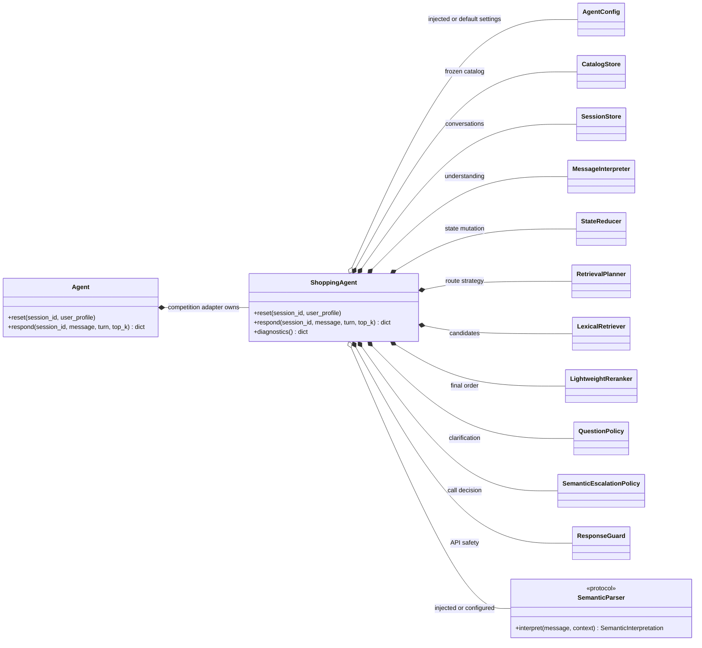
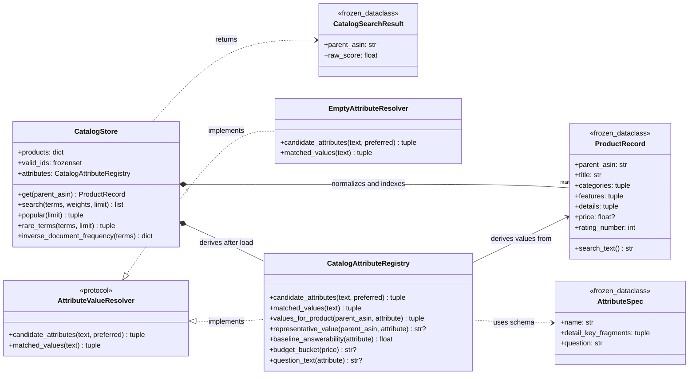
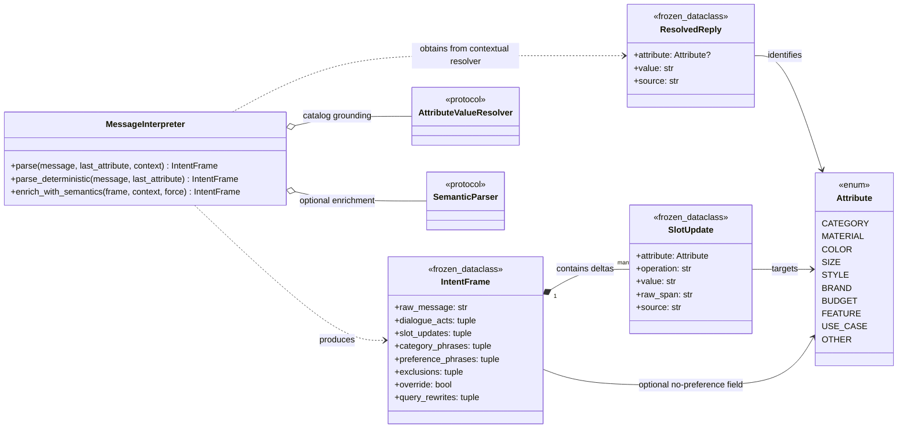
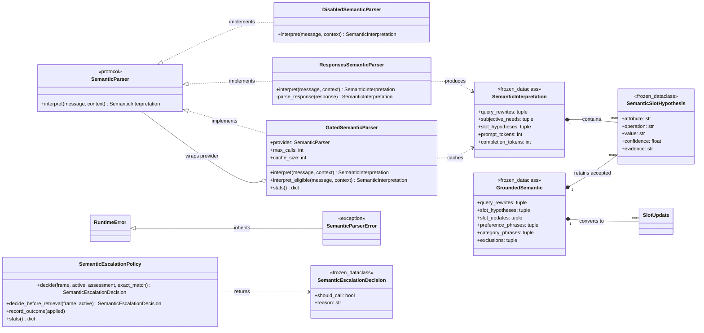
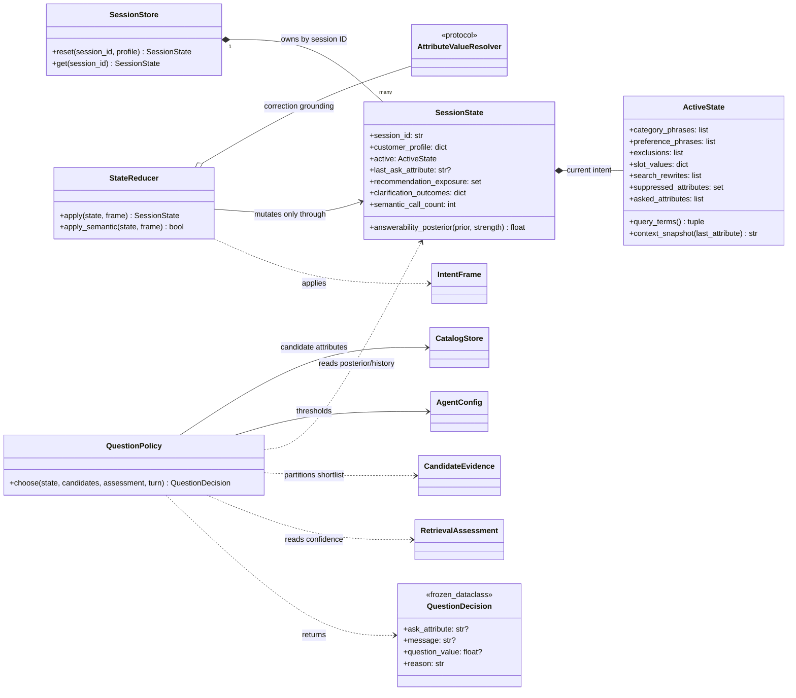
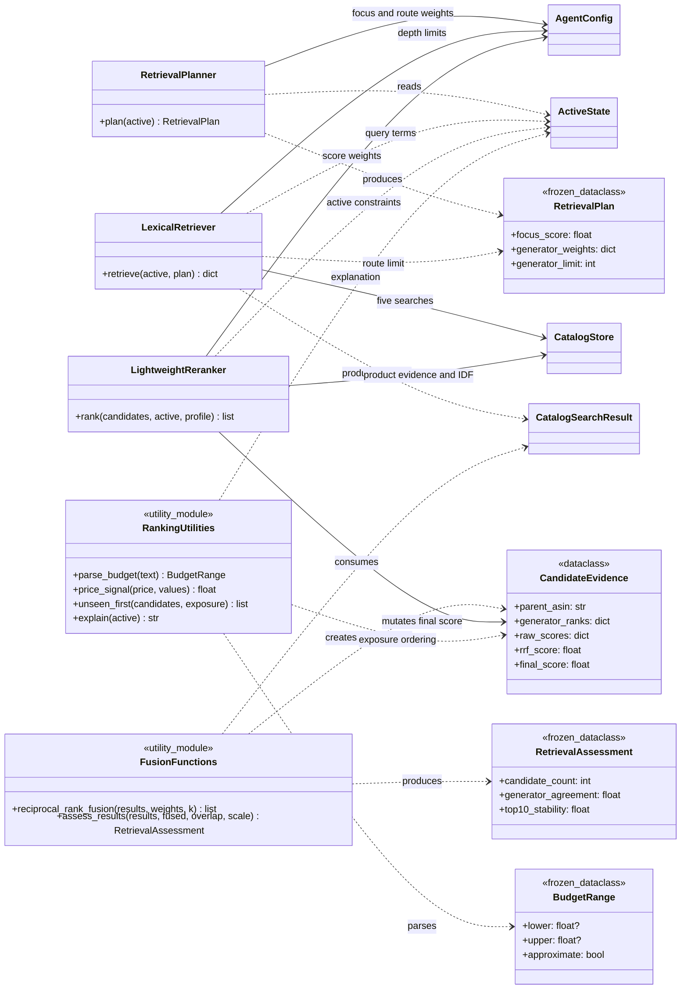
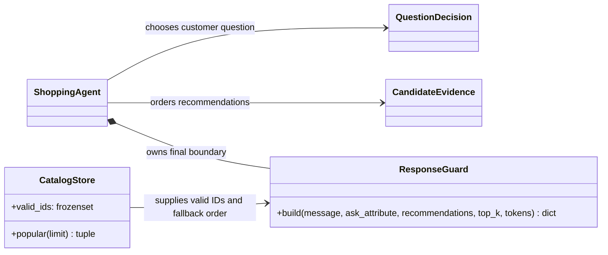
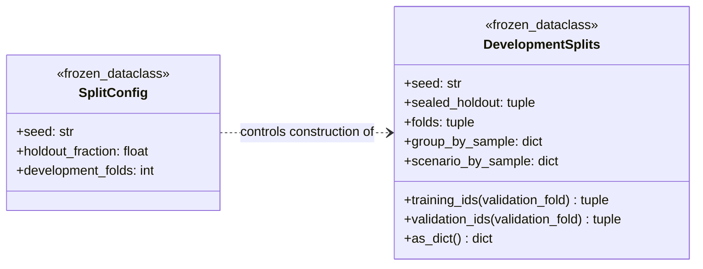

# Shopping Copilot Class Diagrams

This document covers every product-runtime class under `submission/` and the
two development-split data classes. Test-case classes are excluded because they
verify the design rather than participate in it. The evaluator is function-based
and has no product-domain classes.

## Relationship legend

| Symbol | Meaning in this codebase |
|---|---|
| `*--` | Composition: the owner creates/contains the part and controls its lifecycle |
| `o--` | Aggregation: a collaborator may be injected or wrapped and can exist independently |
| `-->` | Association: calls, reads, produces, or otherwise uses |
| `<|--` | Class inheritance |
| `<|..` | Structural implementation of a `Protocol` |
| `..>` | Short-lived dependency, normally an input or return value |

The design deliberately favors composition over class inheritance. The only
concrete inheritance is `SemanticParserError` from `RuntimeError`; polymorphism
is supplied through the two small protocols.

## 1. Whole runtime composition

Use notes:

- `Agent` is the thin class the organizer imports. It delegates the required API
  without exposing internal components.
- `ShoppingAgent` is the composition root and turn orchestrator. This is the
  best starting point for tracing a request.
- `AgentConfig` holds immutable retrieval, ranking, question, and LLM limits.
  Components share the same instance so one configuration controls a run.

## 2. Catalog and catalog-derived attributes

Use notes:

- `ProductRecord` is the normalized immutable representation of one frozen
  catalog product. Missing fields become safe empty/unknown values here.
- `CatalogSearchResult` is the minimal result returned by an individual SQLite
  FTS or popularity route before cross-route fusion.
- `CatalogStore` owns the in-memory SQLite FTS5 index, normalized records,
  document-frequency helpers, valid IDs, and catalog popularity ordering.
- `AttributeSpec` defines one question-capable field and how it maps to catalog
  detail keys; the instances are module-level immutable schema data.
- `AttributeValueResolver` lets interpretation depend on catalog knowledge
  without depending on a concrete store implementation.
- `EmptyAttributeResolver` is the safe null-object implementation used when no
  catalog resolver is supplied.
- `CatalogAttributeRegistry` derives value vocabularies, product attributes,
  answerability priors, and price buckets from the frozen catalog.

## 3. Deterministic message understanding

Use notes:

- `Attribute` is the canonical field vocabulary shared with the competition
  contract.
- `ResolvedReply` represents one explicit or contextual value resolution before
  it becomes a state operation.
- `SlotUpdate` is an immutable state delta such as `replace color with black`,
  `set_any budget`, or `exclude leather`.
- `IntentFrame` is the complete immutable interpretation of one customer turn.
  It separates parsing from state mutation and makes behavior testable.
- `MessageInterpreter` performs deterministic parsing first and optionally
  merges locally grounded LLM operations. It never mutates session state.

## 4. Optional semantic interpretation

Use notes:

- `SemanticParser` is the provider-neutral interface used by the interpreter.
- `DisabledSemanticParser` returns an empty result, keeping the complete offline
  path available when credentials, network, or permission are absent.
- `ResponsesSemanticParser` owns the Responses-compatible HTTP request and
  parses the forced function-tool arguments; it never selects catalog IDs.
- `GatedSemanticParser` wraps a provider with process call budget, LRU cache,
  timeout fallback metrics, and thread-safe counters.
- `SemanticParserError` is the sanitized provider failure type caught by the
  gate; it inherits normal `RuntimeError` behavior.
- `SemanticSlotHypothesis` is one untrusted model proposal with an evidence span
  and explicit operation.
- `SemanticInterpretation` is the complete provider result plus reported token
  usage before local grounding.
- `GroundedSemantic` contains only hypotheses, rewrites, and state deltas that
  passed local evidence and safety checks.
- `SemanticEscalationDecision` explains whether a billed call is justified.
- `SemanticEscalationPolicy` owns the mutually exclusive pre-retrieval and
  retrieval-aware call decisions plus non-secret outcome counters.

The grounding operation itself is intentionally a pure function in
`semantic_grounding.py`; it converts `SemanticInterpretation` into
`GroundedSemantic` without owning either object.

## 5. Conversation state and clarification

Use notes:

- `ActiveState` holds only the current customer intent. LLM rewrites are kept
  separate from durable customer facts so corrections can invalidate them.
- `SessionState` adds turn history, profile, product exposure, clarification
  outcomes, and the per-session semantic-call counter around `ActiveState`.
- `SessionStore` owns independent session objects behind a lock. It fails
  clearly if `respond` reaches `get` before the required `reset` call.
- `StateReducer` is the only intended writer of active intent. It applies each
  attribute operation independently so unrelated constraints persist.
- `QuestionDecision` is the immutable result of clarification scoring.
- `QuestionPolicy` scores candidate coverage, diversity, catalog answerability,
  session outcomes, and retrieval confidence while excluding already asked or
  suppressed fields.

## 6. Retrieval, fusion, and ranking

Use notes:

- `RetrievalPlan` freezes the current Buying/Browsing focus score, blended route
  weights, and per-route depth for one retrieval pass.
- `CandidateEvidence` is the mutable cross-stage carrier: fusion records route
  ranks and RRF score, then the reranker adds `final_score`.
- `RetrievalAssessment` summarizes candidate count, generator agreement, and
  Top-10 stability for semantic gating and question confidence.
- `RetrievalPlanner` converts accumulated evidence into a soft focused versus
  exploratory blend rather than assigning a permanent scenario label.
- `LexicalRetriever` runs field, title, category, category-popularity, and
  focused-constraint candidate generators against the same frozen store.
- `LightweightReranker` combines normalized RRF, IDF coverage, exact phrases,
  capped profile/popularity evidence, budget fit, and exclusion penalties.
- `BudgetRange` is the normalized optional lower/upper price constraint returned
  by the function-based budget parser.

`FusionFunctions` and `RankingUtilities` are diagrammed as module nodes because
they are stateless functions, not instantiated classes.

## 7. Response boundary

Use note:

- `ResponseGuard` is the last API boundary. It removes invalid/duplicate IDs,
  caps recommendations at ten, validates `ask_attribute`, normalizes token
  counts, and fills safely from catalog popularity when needed.

## 8. Development split classes

Use notes:

- `SplitConfig` fixes the deterministic seed, release-check fraction, and number
  of development folds.
- `DevelopmentSplits` stores target/title-family-disjoint sample assignments and
  exposes rotating training/validation IDs. It is development-only and is never
  imported by submission runtime code.

## Reading order

For a first code trace, read the classes in this order:

1. `Agent` and `ShoppingAgent` for orchestration.
2. `IntentFrame`, `SlotUpdate`, `ActiveState`, and `StateReducer` for the
   interpretation-to-memory contract.
3. `RetrievalPlan`, `LexicalRetriever`, `CandidateEvidence`, and
   `LightweightReranker` for product ordering.
4. `QuestionPolicy` for the feedback loop.
5. `SemanticEscalationPolicy`, `GatedSemanticParser`, and
   `ResponsesSemanticParser` for optional LLM behavior.
6. `ResponseGuard` for the final competition-safe response.

