# Shopping Copilot System Flowcharts

This document is the visual, implementation-level guide to the Shopping Copilot.
It describes the system that exists on the current branch. Optional or deferred
paths are labelled so they are not mistaken for the reliable default path.

## Component map

| Component | Responsibility | Primary implementation |
|---|---|---|
| Official adapter | Expose the required `Agent` contract | [`starter/agent.py`](../starter/agent.py) |
| Orchestrator | Coordinate one complete response | [`shopping_copilot/agent.py`](../shopping_copilot/agent.py) |
| Catalog | Validate records and build read-only indexes | [`shopping_copilot/catalog/`](../shopping_copilot/catalog/) |
| Understanding | Convert a message into immutable proposed updates | [`shopping_copilot/understanding/`](../shopping_copilot/understanding/) |
| Dialog state | Apply corrections and own mutable session state | [`shopping_copilot/dialog/`](../shopping_copilot/dialog/) |
| Retrieval | Plan, generate, fuse, and assess candidates | [`shopping_copilot/retrieval/`](../shopping_copilot/retrieval/) |
| Ranking | Rerank, apply novelty, budget, and explanations | [`shopping_copilot/ranking/`](../shopping_copilot/ranking/) |
| Response guard | Enforce allowed attributes and catalog IDs | [`shopping_copilot/contracts.py`](../shopping_copilot/contracts.py) |
| Evaluation | Simulate sessions and calculate official metrics | [`evaluator/local_evaluator.py`](../evaluator/local_evaluator.py) |

## 1. Entire system

```mermaid
flowchart LR
    Catalog[(Frozen 50k-product<br/>catalog JSONL)] --> CatalogStore[CatalogStore<br/>records + SQLite FTS5]
    PublicSet[(Public sessions)] --> Evaluator[Local evaluator]

    Evaluator -->|reset with profile| SessionStore[SessionStore]
    Evaluator -->|respond with message| Agent[ShoppingAgent]
    SessionStore --> Agent

    Agent --> Interpreter[MessageInterpreter]
    Interpreter --> Reducer[StateReducer]
    Reducer --> Active[Active State]

    Active --> Planner[RetrievalPlanner]
    Planner --> Generators[Five lexical generators]
    CatalogStore --> Generators
    Generators --> Fusion[Weighted RRF]
    Fusion --> Assessment[RetrievalAssessment]
    Fusion --> Reranker[LightweightReranker]
    Active --> Reranker

    Assessment -. uncertain language .-> Semantic[Optional semantic translator]
    Semantic -. grounded additions only .-> Reducer
    Reducer -. state changed .-> Planner

    Reranker --> Exposure[Unseen-first exposure]
    Exposure --> Question[QuestionPolicy]
    Assessment --> Question
    Question --> Guard[ResponseGuard]
    Exposure --> Guard
    Guard -->|message + ask_attribute<br/>+ Top 10 ASINs + usage| Evaluator

    Agent -. component exception .-> Fallback[Field-weighted FTS fallback]
    CatalogStore --> Fallback
    Fallback --> Guard
```

The default path is offline and deterministic. The LLM is not a recommender: it
is an optional translator used between the first retrieval and final decision.
Every successful path ends at `ResponseGuard`, so only valid frozen-catalog IDs
and contract-safe fields leave the agent.

## 2. Catalog ingestion and indexing

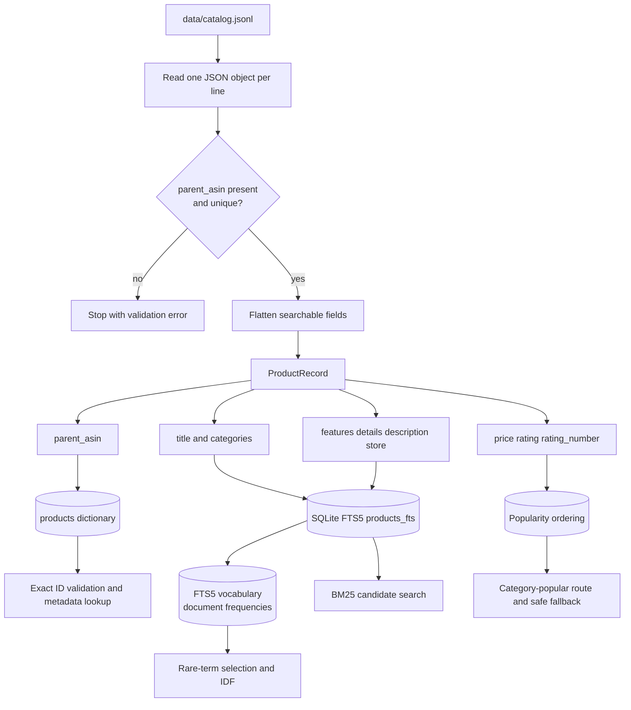

Technical behavior:

- Source records are never modified. Derived lookup views live in memory.
- Missing text becomes an empty string or tuple. Missing numeric values become
  `None`, except missing `rating_number`, which contributes zero popularity.
- Unicode text is normalized with NFKC and case folding for lookup, while raw
  catalog phrases remain available as searchable evidence.
- The FTS table indexes title, categories, features, details, store, and
  description separately. BM25 field weights therefore vary by retrieval route.
- Duplicate or empty `parent_asin` values fail during startup because exact ID
  equality is the scoring boundary.

## 3. Runtime data structures

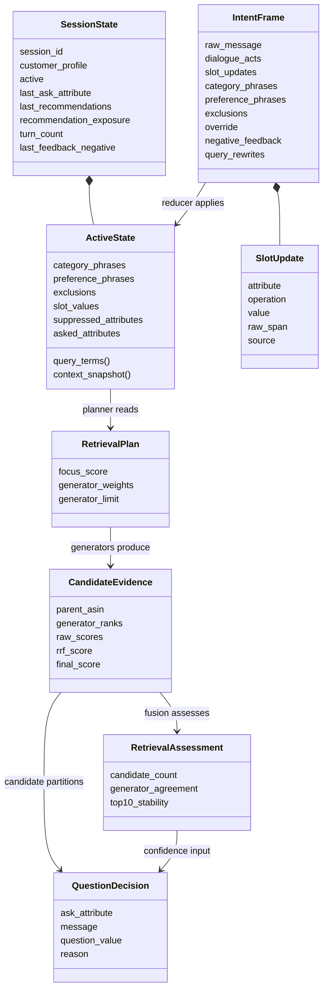

The key boundary is between `IntentFrame` and `ActiveState`. The interpreter
proposes immutable events; only `StateReducer` may mutate active session state.
This prevents parsing, retrieval, and ranking from silently disagreeing about
which preferences remain current.

## 4. One `respond` call

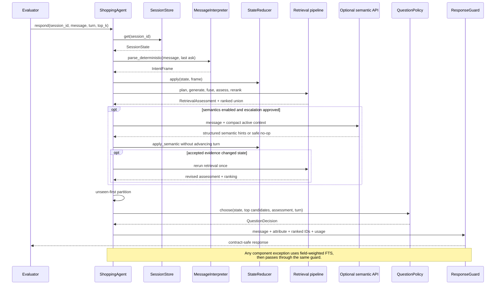

The deterministic frame is applied before the first retrieval. A semantic frame
can add only locally grounded evidence and does not increment `turn_count`. At
most one semantic reretrieval occurs in a response.

## 5. Message interpretation

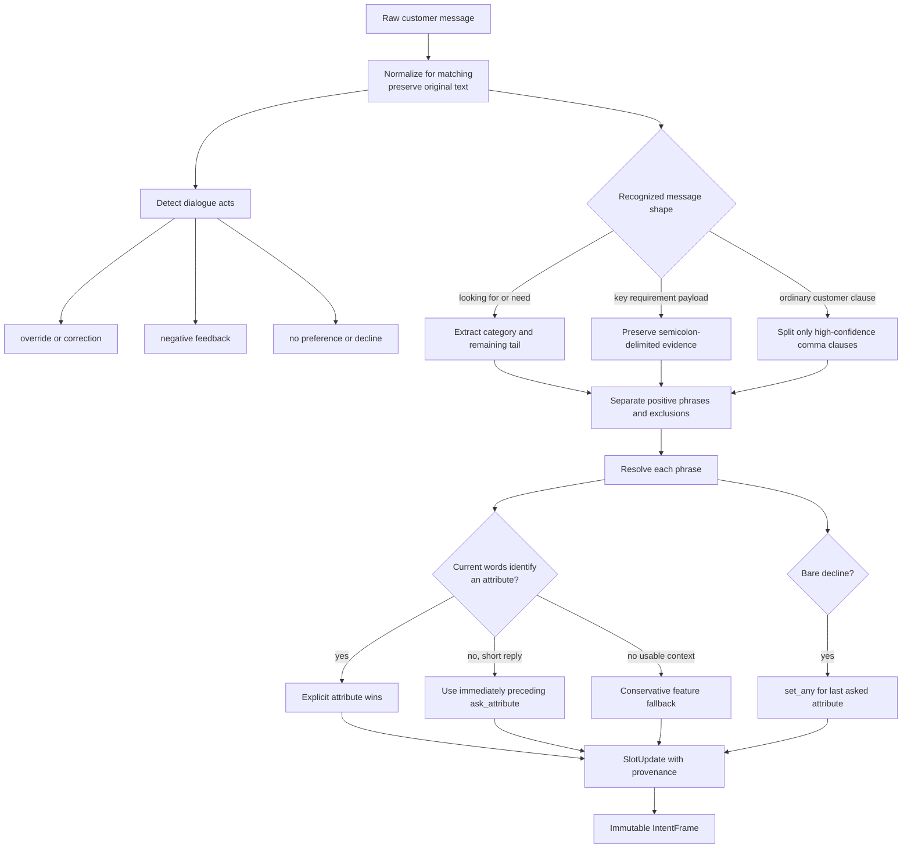

Parsing precedence is deliberate:

1. explicit evidence in the current message;
2. the immediately preceding structured question for bounded short replies;
3. a searchable fallback phrase when no safer attribute is available.

Bare affirmations such as `yes` are not preference evidence. Bare declines such
as `no` become `set_any` only when the previous `ask_attribute` supplies a safe
meaning. Each update records `explicit`, `contextual`, `fallback`, or `semantic`
provenance.

## 6. State reduction and intent override

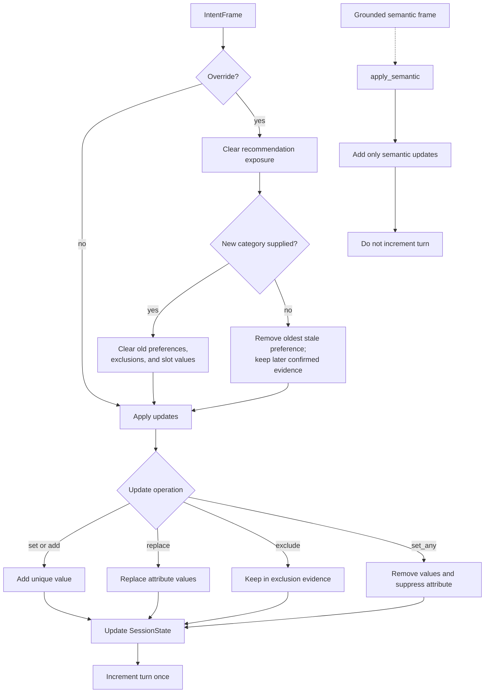

Intent override is replacement, not accumulation. A category change invalidates
all earlier product-specific evidence. A preference-only correction removes the
oldest stale preference but retains evidence confirmed later in the session.
Exposure is reset because a product rejected under the previous intent may be
valid under the corrected one.

## 7. Retrieval planning and candidate generation

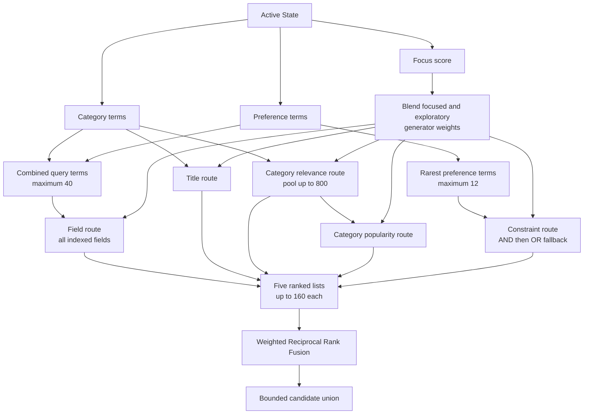

The focus score is a soft controller, not a prediction of the evaluator's
Buying label:

```text
z = -1.1 + 0.95 × preference_or_exclusion_count + 0.35 × has_category
focus_score = sigmoid(z)
route_weight = focus_score × focused_weight
             + (1 - focus_score) × exploratory_weight
```

All cheap routes still run. Focus changes their influence rather than selecting
one brittle route. Field-specific BM25 weights make the same catalog index act
as several candidate generators.

## 8. Fusion, assessment, and reranking

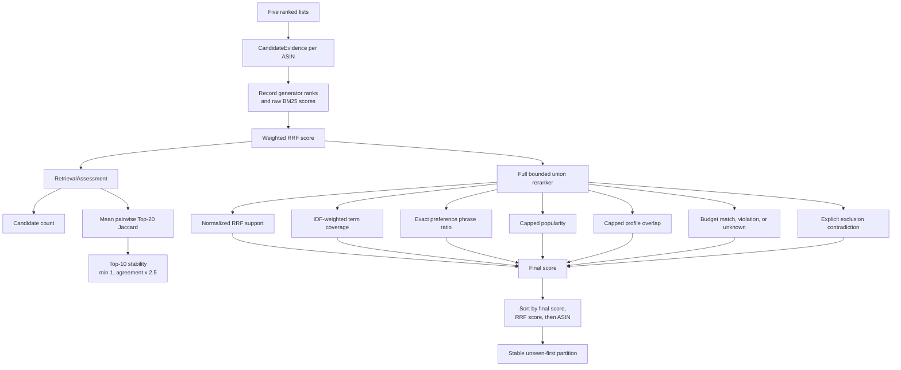

For candidate `p`, the implemented score is:

```text
score(p) = 0.52 × normalized_RRF
         + 0.36 × IDF_coverage
         + 0.12 × exact_phrase_ratio
         + profile_score, capped at 0.03
         + 0.18 × capped_popularity
         + 0.12 × budget_signal
         - 0.70 × exclusion_contradiction
```

Weighted RRF uses `weight / (60 + rank)` for each generator. Missing price has a
budget signal of zero rather than being treated as over budget. The profile can
break close ties but cannot overpower current-session evidence. `unseen_first`
does not alter scores; it preserves order inside the unseen and already-shown
partitions.

## 9. Optional semantic interpretation

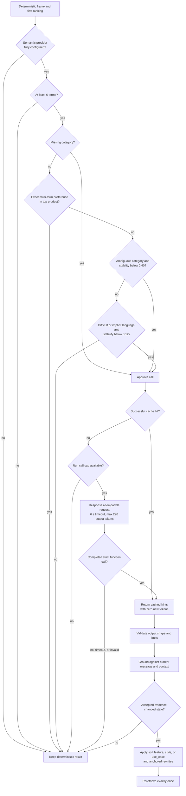

Semantic output is untrusted until locally grounded. The grounder rejects ASINs,
negated rewrites, unanchored text, overlong values, unsupported evidence spans,
low-confidence hypotheses, and semantic attributes already determined by the
rules. Structured hypotheses are limited to `feature`, `style`, and `use_case`.

The process call cap defaults to 16, successful responses use a 256-entry LRU
cache, and failures are not retried. The LLM path is off by default because live
tests have not yet improved a measured ranking. The forced function-tool request
has mocked coverage but still requires one capped live compatibility test.

## 10. Clarification and action selection

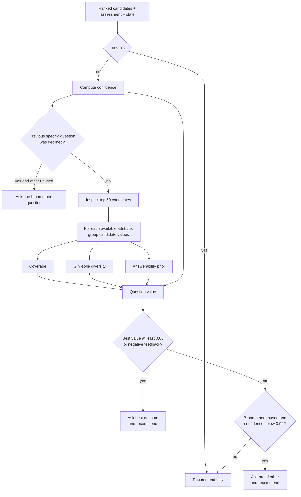

Implemented confidence and value are target-blind heuristics:

```text
confidence = 0.55 × top10_stability
           + 0.45 × min(1, preference_phrase_count / 3)

question_value(attribute) = coverage
                          × diversity
                          × answerability_prior
                          × (1 - confidence)
```

Already asked or explicitly declined attributes are unavailable. The one-time
`other` recovery avoids a field-by-field interview and lets the customer name a
priority the catalog taxonomy did not anticipate. Recommendations are still
returned while a question is asked.

## 11. Explanation, output guard, and fallback

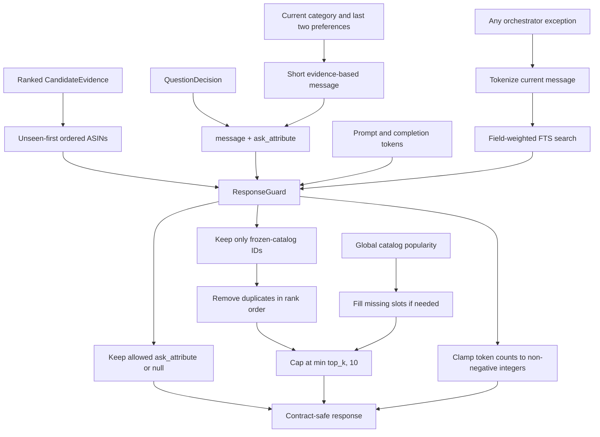

The guard is the trust boundary for all upstream components. It accepts an
ordered iterable rather than trusting a ranker-specific object, filters against
`CatalogStore.valid_ids`, and fills short lists with deterministic popular
catalog products. Even the exception fallback passes through the same guard.

## 12. Evaluation loop

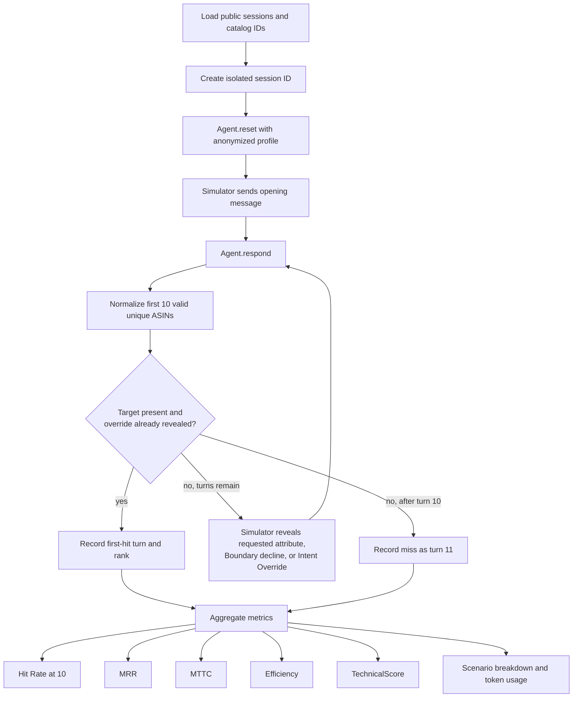

The evaluator owns target labels and simulator behavior; runtime code does not
import them. Only exact `parent_asin` equality is a hit. Intent Override sessions
cannot score before the corrected intent is revealed. A miss contributes zero
to MRR and turn 11 to MTTC.

```text
Efficiency = clip((11 - MTTC) / 10, 0, 1)
TechnicalScore = 0.50 × HitRate@10 + 0.30 × MRR + 0.20 × Efficiency
```

## 13. Failure-containment view

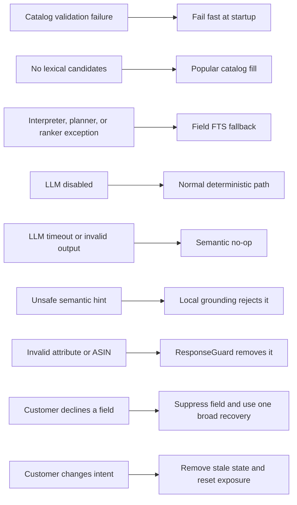

The design preserves one complete offline route and contains optional failures at
their boundary. This is important for both competition reliability and a real
shopping experience: a slow model or incomplete catalog field should degrade
the sophistication of the answer, not invalidate the response.

## Reading order for implementation work

1. Start with the entire-system diagram and the `respond` sequence.
2. Read message interpretation and state reduction together; their boundary is
   the most important correctness contract.
3. Read retrieval planning before reranking so route weights and final feature
   weights are not confused.
4. Treat the semantic diagram as an optional second pass, not the main pipeline.
5. Use clarification, guard, and evaluator diagrams to verify changes against the
   ten-turn and exact-ASIN objective.

For formulas, tuning rationale, deferred alternatives, and ownership, continue
with [`architecture.md`](architecture.md). For measured experiments and rejected
approaches, see [`findings.md`](findings.md).
