# Shopping Copilot System Flowcharts

This document is the visual, implementation-level guide to the Shopping Copilot.
It describes the system that exists on the current branch. The implemented
optional semantic path is labelled so it is not mistaken for the offline default.

## Component map

| Component | Responsibility | Primary implementation |
|---|---|---|
| Official adapter | Expose the required `Agent` contract | [`submission/agent.py`](../submission/agent.py) |
| Evaluator shim | Preserve the supplied evaluator import | [`starter/agent.py`](../starter/agent.py) |
| Orchestrator | Coordinate one complete response | [`submission/src/agent.py`](../submission/src/agent.py) |
| Catalog | Validate records and build read-only indexes | [`submission/src/catalog/`](../submission/src/catalog/) |
| Understanding | Convert a message into immutable proposed updates | [`submission/src/understanding/`](../submission/src/understanding/) |
| Dialog state | Apply corrections and own mutable session state | [`submission/src/dialog/`](../submission/src/dialog/) |
| Retrieval | Plan, generate, fuse, and assess candidates | [`submission/src/retrieval/`](../submission/src/retrieval/) |
| Ranking | Rerank, apply novelty, budget, and explanations | [`submission/src/ranking/`](../submission/src/ranking/) |
| Response guard | Enforce allowed attributes and catalog IDs | [`submission/src/contracts.py`](../submission/src/contracts.py) |
| Evaluation | Simulate sessions and calculate official metrics | [`evaluator/local_evaluator.py`](../evaluator/local_evaluator.py) |

## 1. Entire system

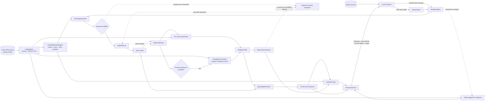

The default path is offline and deterministic. The LLM is a structured state
interpreter and query translator, not a source of product IDs. It runs either
before state mutation for compound/unresolved language or after first retrieval
for instability, never both in one turn.
Every successful path ends at `ResponseGuard`, so only valid frozen-catalog IDs
and contract-safe fields leave the agent.

## 2. Catalog ingestion and indexing

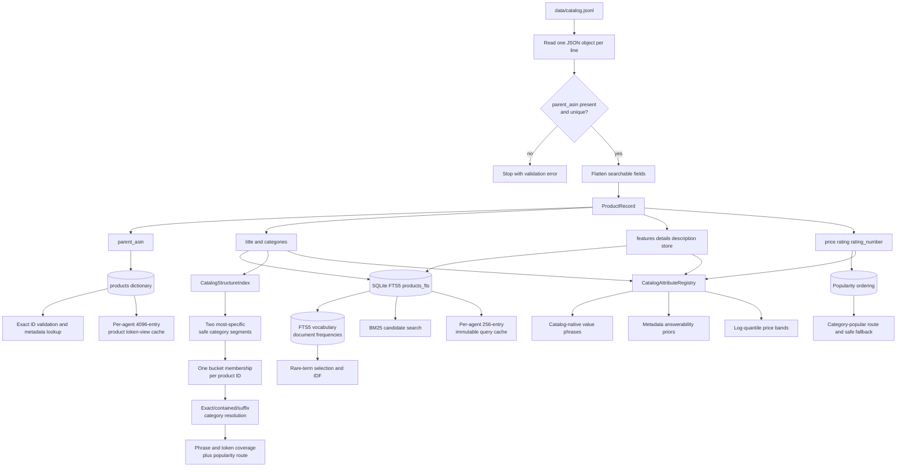

Technical behavior:

- Source records are never modified. Derived lookup views live in memory.
- Missing text becomes an empty string or tuple. Missing numeric values become
  `None`, except missing `rating_number`, which contributes zero popularity.
- Unicode text is normalized with NFKC and case folding for lookup, while raw
  catalog phrases remain available as searchable evidence.
- The FTS table indexes title, categories, features, details, store, and
  description separately. BM25 field weights therefore vary by retrieval route.
- Structural buckets are derived only from catalog categories and never replace
  the FTS index. Missing or unresolved structure returns no additional route.
- Query and token-view caches are bounded per `CatalogStore`, so a long-running
  process neither shares counters nor retains old agent instances globally.
- Duplicate or empty `parent_asin` values fail during startup because exact ID
  equality is the scoring boundary.

## 3. Runtime data structures

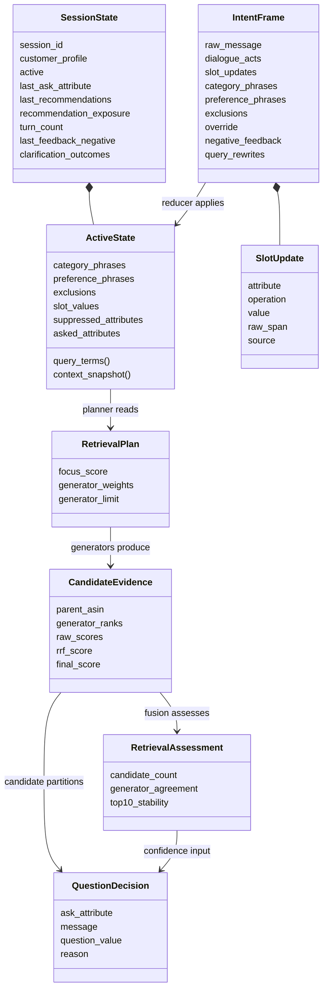

The key boundary is between `IntentFrame` and `ActiveState`. The interpreter
proposes immutable events; only `StateReducer` may mutate active session state.
This prevents parsing, retrieval, and ranking from silently disagreeing about
which preferences remain current.

## 4. One `respond` call

```mermaid
sequenceDiagram
    participant E as Evaluator
    participant A as ShoppingAgent
    participant S as SessionStore
    participant I as MessageInterpreter
    participant R as StateReducer
    participant Q as Retrieval pipeline
    participant L as Optional semantic API
    participant P as QuestionPolicy
    participant G as ResponseGuard

    E->>A: respond(session_id, message, turn, top_k)
    A->>S: get(session_id)
    S-->>A: SessionState
    alt exact duplicate or late turn
        A-->>E: stored response snapshot; no state replay
    else new turn
    A->>I: parse_deterministic(message, last ask)
    I-->>A: IntentFrame
    opt semantic preflight approved
        A->>L: message + structured prior Active State
        L-->>A: grounded field operations + standalone rewrites or safe no-op
    end
    A->>R: apply(state, frame)
    A->>Q: plan, generate, fuse, assess, rerank
    Q-->>A: RetrievalAssessment + ranked union

    opt preflight skipped and retrieval-aware escalation approved
        A->>L: message + compact active context
        L-->>A: structured semantic hints or safe no-op
        A->>R: apply_semantic without advancing turn
        opt accepted evidence changed state
            A->>Q: rerun retrieval once
            Q-->>A: revised assessment + ranking
        end
    end

    A->>A: unseen-first partition
    A->>A: freeze first 10 IDs and apply bounded ordering
    A->>P: choose(state, top candidates, assessment, turn)
    P-->>A: QuestionDecision
    A->>G: message + attribute + ranked IDs + usage
    G-->>E: contract-safe response
    end

    Note over A,G: Any component exception prefers the last good list,<br/>then field FTS, then the same guard.
```

Compound-turn semantics enriches the frame before its single state reduction. If
that gate skips, a post-retrieval semantic frame can apply locally grounded
evidence without incrementing `turn_count`, followed by at most one reretrieval.
The two paths are mutually exclusive.

## 5. Message interpretation

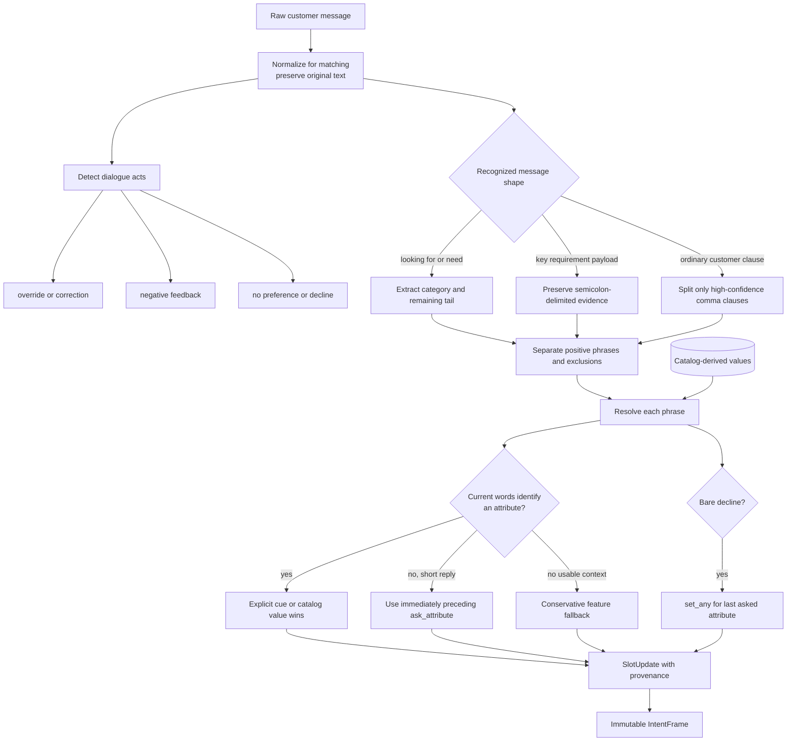

Parsing precedence is deliberate:

1. explicit evidence in the current message;
2. the immediately preceding structured question for bounded short replies;
3. a searchable fallback phrase when no safer attribute is available.

Bare affirmations such as `yes` are not preference evidence. Bare declines such
as `no` become `set_any` only when the previous `ask_attribute` supplies a safe
meaning. Each update records `explicit`, `contextual`, `fallback`, or `semantic`
provenance.

## 6. State reduction and intent override

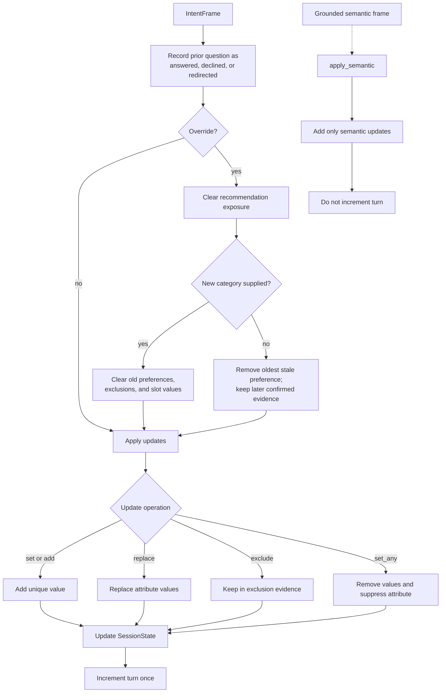

Intent override is replacement, not accumulation. A category change invalidates
all earlier product-specific evidence. A preference-only correction removes the
oldest stale preference but retains evidence confirmed later in the session.
Exposure is reset because a product rejected under the previous intent may be
valid under the corrected one.

## 7. Retrieval planning and candidate generation

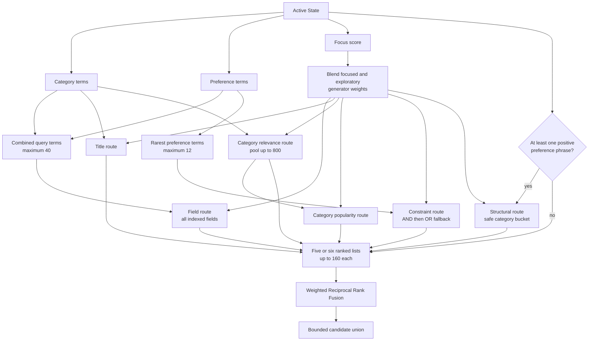

The focus score is a soft controller, not a prediction of the evaluator's
Buying label:

```text
z = -1.1 + 0.95 × preference_or_exclusion_count + 0.35 × has_category
focus_score = sigmoid(z)
route_weight = focus_score × focused_weight
             + (1 - focus_score) × exploratory_weight
```

All five FTS routes still run. Focus changes their influence rather than
selecting one brittle route. Field-specific BM25 weights make the same catalog
index act as several candidate generators. The structural route is additive and
joins only after a preference phrase makes its family ordering discriminative;
failure to resolve a category leaves the FTS ensemble unchanged.

## 8. Fusion, assessment, and reranking

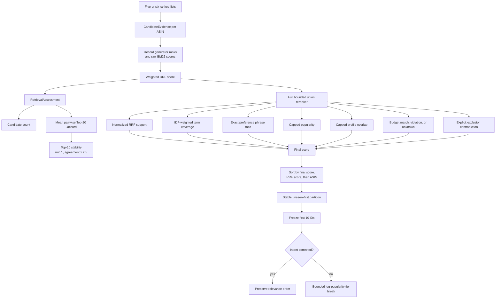

For candidate `p`, the implemented score is:

```text
score(p) = 0.52 × normalized_RRF
         + 0.36 × IDF_coverage
         + 0.12 × exact_phrase_ratio
         + profile_score, capped at 0.03
         + 0.18 × capped_popularity
         + 0.12 × budget_signal
         - 0.70 × exclusion_contradiction
```

Weighted RRF uses `weight / (60 + rank)` for each generator. Missing price has a
budget signal of zero rather than being treated as over budget. The profile can
break close ties but cannot overpower current-session evidence. `unseen_first`
does not alter scores; it preserves order inside the unseen and already-shown
partitions.

The final orderer cannot change membership. Its retained `0.05` popularity
weight improves public working-fold MRR while exact intent corrections disable
that weak prior. Phrase-rarity and profile-ordering weights are currently zero.

## 9. Optional semantic interpretation

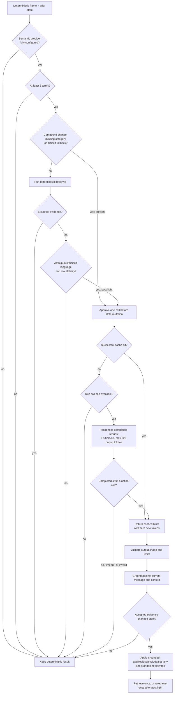

Semantic output is untrusted until locally grounded. The grounder rejects ASINs,
vague/negated rewrites, invalid field operations, hard values missing from their
exact evidence spans, overlong values, low confidence, and conflicts with
explicit deterministic evidence. All competition fields except `other` are
permitted in semantic state operations.

The process call cap defaults to 16, each session permits at most two attempts,
successful responses use a 256-entry LRU cache, and failures are not retried. The LLM path is off by default because live
tests have not yet improved a measured ranking. The forced function-tool request
has mocked coverage but still requires one capped live compatibility test.

## 10. Clarification and action selection

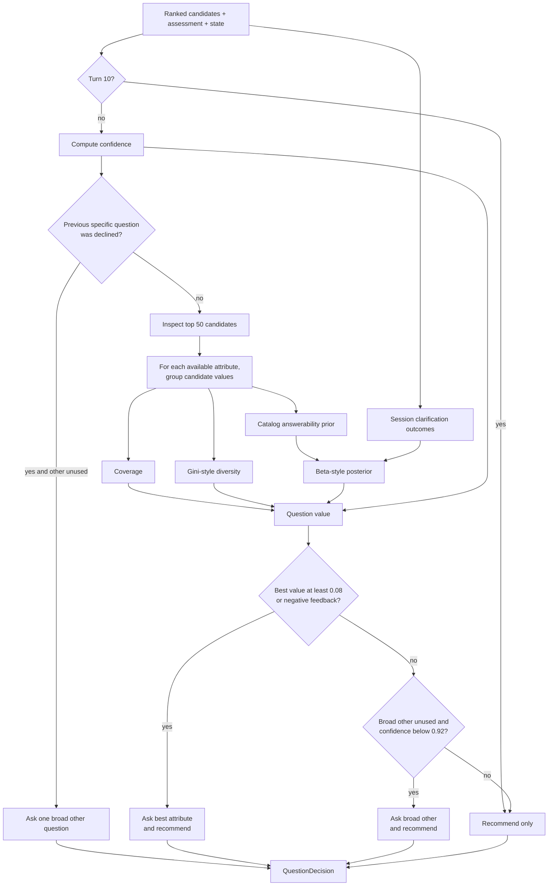

Implemented confidence and value are target-blind heuristics:

```text
confidence = 0.55 × top10_stability
           + 0.45 × min(1, preference_phrase_count / 3)

question_value(attribute) = coverage
                          × diversity
                          × session_answerability_posterior
                          × (1 - confidence)
```

Already asked or explicitly declined attributes are unavailable. The one-time
`other` recovery avoids a field-by-field interview and lets the customer name a
priority the catalog taxonomy did not anticipate. Recommendations are still
returned while a question is asked. Baselines come from frozen-catalog coverage
and repeated-value support; answers and declines update only the current
session, and `reset()` clears those observations.

## 11. Explanation, output guard, and fallback

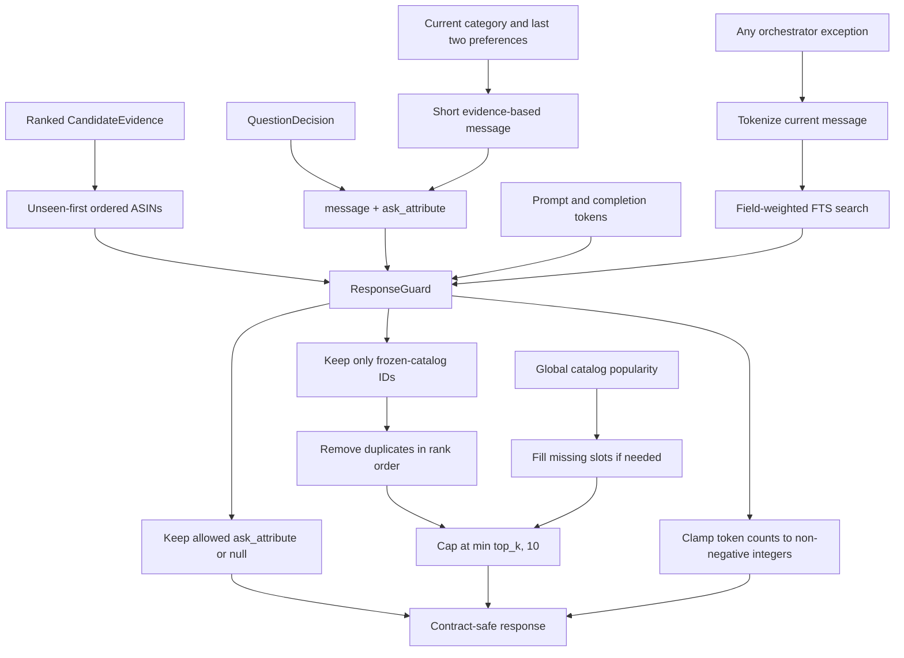

The guard is the trust boundary for all upstream components. It accepts an
ordered iterable rather than trusting a ranker-specific object, filters against
`CatalogStore.valid_ids`, and fills short lists with deterministic popular
catalog products. Even the exception fallback passes through the same guard.

## 12. Evaluation loop

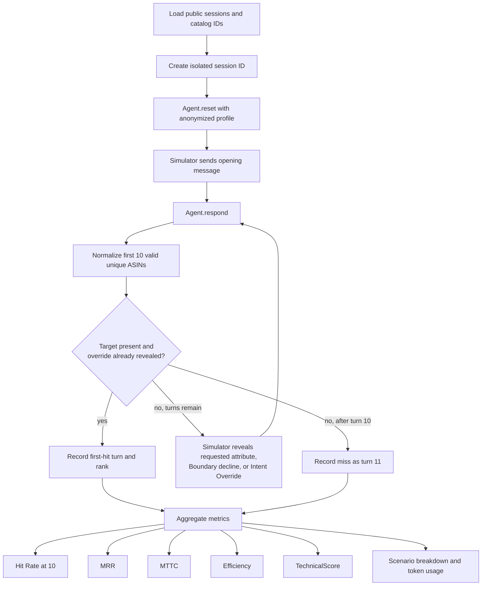

The evaluator owns target labels and simulator behavior; runtime code does not
import them. Only exact `parent_asin` equality is a hit. Intent Override sessions
cannot score before the corrected intent is revealed. A miss contributes zero
to MRR and turn 11 to MTTC.

```text
Efficiency = clip((11 - MTTC) / 10, 0, 1)
TechnicalScore = 0.50 × HitRate@10 + 0.30 × MRR + 0.20 × Efficiency
```

## 13. Development split and release gate

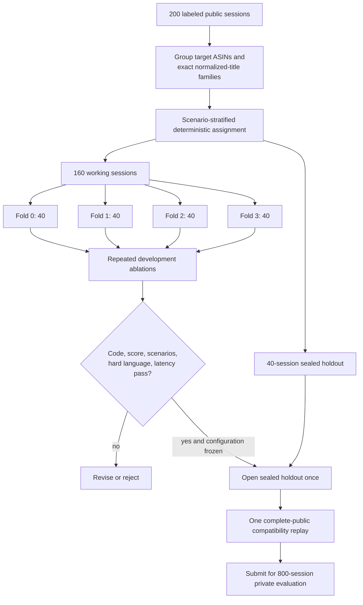

Every 40-session partition contains 16 Buying, 16 Browsing, 6 Intent Override,
and 2 Boundary sessions. Neither a sample nor a target/title family crosses a
partition. Catalog-only statistics may use all 50,000 products because the
catalog is legal runtime input; labels and evaluator-generated intent remain
offline only. See [evaluation-methodology.md](evaluation-methodology.md).

## 14. Failure-containment view

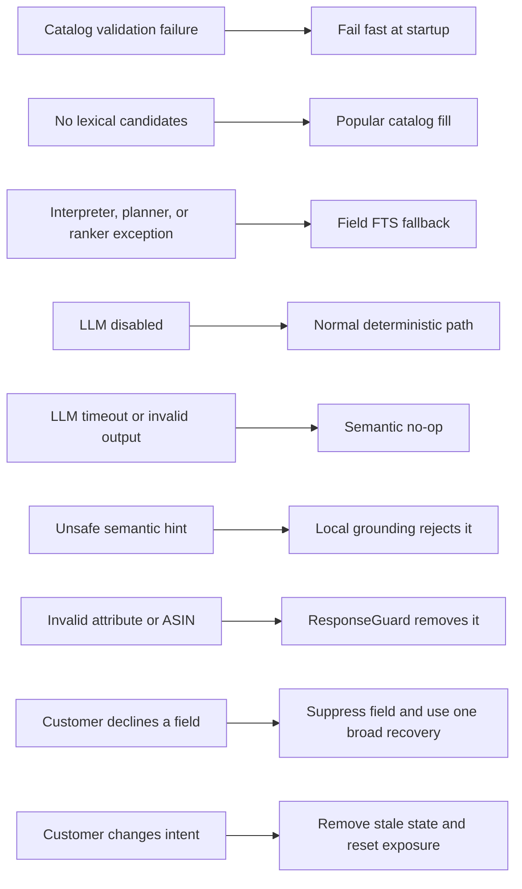

The design preserves one complete offline route and contains optional failures at
their boundary. This is important for both competition reliability and a real
shopping experience: a slow model or incomplete catalog field should degrade
the sophistication of the answer, not invalidate the response.

## Reading order for implementation work

1. Start with the entire-system diagram and the `respond` sequence.
2. Read message interpretation and state reduction together; their boundary is
   the most important correctness contract.
3. Read retrieval planning before reranking so route weights and final feature
   weights are not confused.
4. Treat semantics as an optional preflight or post-retrieval fallback, not the
   main pipeline.
5. Use clarification, guard, and evaluator diagrams to verify changes against the
   ten-turn and exact-ASIN objective.

For formulas, tuning rationale, and ownership, continue with
[`architecture.md`](architecture.md). For measured experiments and rejected
approaches, see [`findings.md`](findings.md); remaining work lives in
[`../TODO.md`](../TODO.md).
