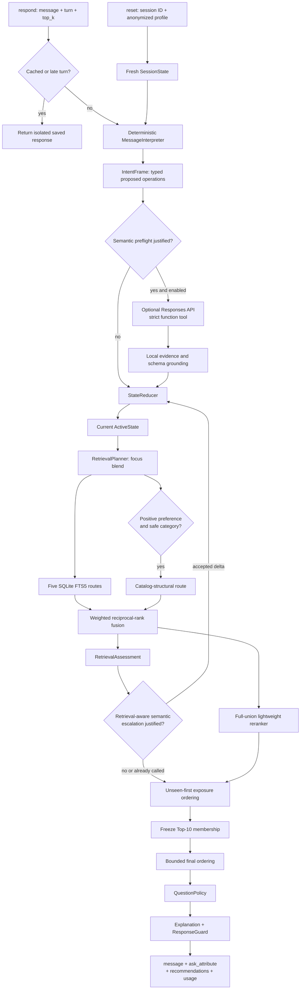
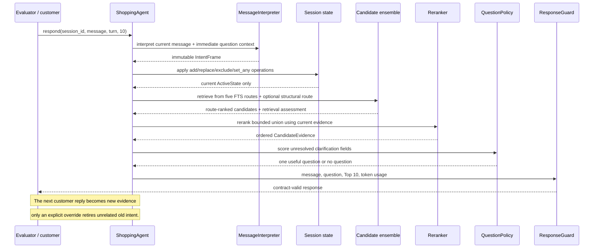
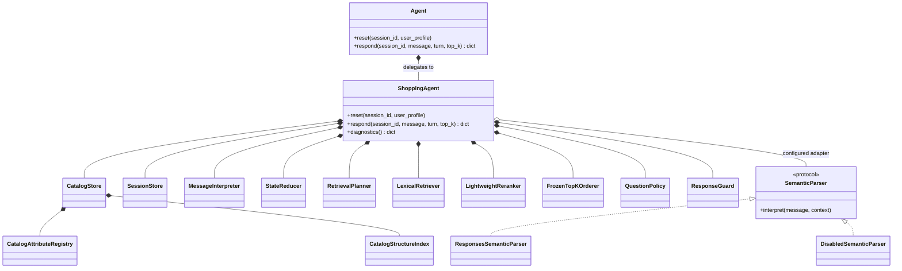

# ShopScout

> Ask less. Preserve what the customer means. Surface the target product sooner.

ShopScout is an offline-first conversational shopping agent for the
TechJam 2026 Conversational E-Commerce Search Challenge. It maintains typed
shopping state, recommends a full Top 10 on every usable turn, and asks one
clarification only when the answer is likely to improve later rankings.

The canonical system uses only Python's standard library and SQLite FTS5. An
optional, strictly gated language-model adapter handles difficult consumer
language without becoming a dependency for valid recommendations.

## Competition objective

The agent receives an anonymized profile and a customer message. Within at most
ten turns, it must place the customer's hidden product among the first ten valid
catalog `parent_asin` values, preferably at rank one and on an early turn.

The official metrics reward three different outcomes:

```text
TechnicalScore = 0.50 × HitRate@10 + 0.30 × MRR + 0.20 × Efficiency
Efficiency = clip((11 - MTTC) / 10, 0, 1)
```

This makes candidate recall, ordering quality, and conversation efficiency
joint requirements. Optimizing only one of them can reduce the final score.

## Results

The following results come from the unmodified 200-session public evaluator,
with the optional LLM disabled:

| Metric | Published starter | ShopScout |
|---|---:|---:|
| Hit Rate@10 | 0.125 | **0.995** |
| MRR | 0.068034 | **0.667556** |
| MTTC | 9.810 | **2.335** |
| Efficiency | 0.119 | **0.8665** |
| TechnicalScore | 0.106710 | **0.871067** |
| Prompt/completion tokens | not reported | **0 / 0** |

| Scenario | Sessions | Hit Rate@10 | MRR | MTTC |
|---|---:|---:|---:|---:|
| Buying | 80 | 1.000000 | 0.650585 | 1.525000 |
| Browsing | 80 | 1.000000 | 0.654315 | 2.487500 |
| Intent Override | 30 | 0.966667 | 0.659524 | 4.000000 |
| Boundary | 10 | 1.000000 | 0.933333 | 2.600000 |

These are public-development results, not an estimate of the 800 private
sessions. The current code misses one public Intent Override session.

## What we optimized for

| Condition | Design choice | Implication |
|---|---|---|
| Exact Top-10 catalog identity | Candidate generators return only frozen-catalog IDs; the response guard removes invalid and duplicate IDs | Semantic similarity alone never counts as success |
| Earliest useful turn | Ask and recommend together; exposure moves previously shown items behind unseen alternatives | The customer receives useful options without waiting for a questionnaire |
| Buying and Browsing | A continuous focus score blends focused and exploratory route weights | No permanent scenario classifier can trap the conversation in the wrong mode |
| Corrections and overrides | Typed `add`, `replace`, `exclude`, and `set_any` operations update only the affected field | Size, budget, and use case persist when color or category changes |
| Sparse catalog metadata | Missing attributes and price are treated as unknown, never as automatic contradictions | Recall is protected, but incomplete products may remain harder to order precisely |
| Frozen 50,000-product catalog | Build FTS, attribute statistics, price quantiles, and compact category buckets at startup | Strong local search with no remote database; catalog changes require an index rebuild |
| CPU and possible network denial | Deterministic standard-library path is complete; the LLM is optional | Canonical scoring costs $0, but open-world semantic coverage is conservative |
| Repeated product-language queries | Bounded per-agent FTS and token-view caches | Warm turns become much faster at the cost of bounded additional memory |
| Private-set uncertainty | Tune on target/title-family-separated public folds and retain a separate hard-language suite | Reduces leakage risk but cannot make public-selected weights truly unseen |

## What differentiates this system

ShopScout is not simply BM25 followed by a chatbot prompt.

- **Conversation is typed state.** Superseded values are retired instead of
  remaining in a concatenated transcript or query.
- **Recommendations are never withheld for a clarification.** Every usable turn
  preserves a Top-10 hit opportunity.
- **Retrieval is an ensemble.** Five field-aware FTS routes preserve broad
  lexical recall. A sixth catalog-structural route joins only after positive
  preference evidence makes its category ordering useful.
- **Constraints are evidence, not brittle filters.** Missing material, size,
  color, or price cannot delete a plausible target.
- **Question selection adapts.** Catalog answerability starts the prior;
  customer answers and declines update the remaining fields for that session.
- **Weak priors cannot sacrifice a hit.** The final Top-10 membership is frozen
  before a bounded popularity ordering pass, which is disabled after overrides.
- **The LLM is contained.** It may propose grounded state operations and search
  rewrites, but it cannot emit product IDs, bypass explicit customer evidence,
  or break the deterministic fallback.
- **Failures remain valid responses.** Duplicate turns are idempotent; late
  turns and component exceptions reuse safe recommendations before global fill.
## Architecture

### End-to-end flow



The two semantic gates are mutually exclusive within a turn. Timeout, malformed
output, rejected grounding, disabled credentials, or network failure leaves the
deterministic result intact.

### One turn and its feedback loop



### Runtime composition



Composition is intentional: `ShoppingAgent` owns the runtime components, while
the semantic provider is replaceable behind a protocol. Runtime code never
inherits from or imports the evaluator.

## Retrieval, ranking, and clarification

### Candidate generation

The focus score is a routing control, not a prediction of the evaluator's
Buying/Browsing label:

```text
z = -1.10 + 0.95 × preference_or_exclusion_count + 0.35 × has_category
focus_score = sigmoid(z)
route_weight = focus_score × focused_weight
             + (1 - focus_score) × exploratory_weight
```

| Route | Purpose |
|---|---|
| `field` | Broad field-weighted query coverage |
| `title` | Product-title precision |
| `category` | Category relevance, with strict AND then safe OR fallback |
| `category_popular` | Separate category-conditioned catalog prior |
| `constraint` | Rarest positive preference terms, strict then recall fallback |
| `structural` | Safely resolved category bucket ranked by phrase coverage, token coverage, and popularity |

The structural route is additive, never a hard category filter. It requires one
positive preference phrase; an unresolved category returns no route.

Weighted Reciprocal Rank Fusion combines incompatible route scales:

```text
RRF(product) = sum_route route_weight / (60 + route_rank)
```

The bounded union is reranked using normalized RRF, IDF-weighted term coverage,
exact positive phrases, capped popularity, capped profile overlap,
missing-neutral budget evidence, and explicit exclusion penalties.

### Clarification

Question value is estimated from top-candidate attribute coverage and diversity,
a catalog-derived answerability prior, the session's answer/decline posterior,
retrieval stability, and the remaining unresolved preferences. Already asked or
explicitly declined fields are suppressed. One broad `other` recovery is
available after a specific field is unhelpful.

This means Buying sessions usually receive constraint-focused questions and
retrieval weights sooner, while vague Browsing sessions receive more exploratory
recommendations and discriminative questions. Both use the same components and
can move continuously between strategies.

## Conversation state and missing data

`IntentFrame` proposes operations; only `StateReducer` mutates `ActiveState`.
The stored state separates:

- product category;
- positive preferences and hard constraints;
- exclusions;
- budget range;
- attributes marked as no preference;
- semantic rewrites;
- asked/declined fields; and
- recommendation exposure.

The immediately preceding structured question may resolve a short reply:

```text
ask size   -> "10"       -> size=10
ask budget -> "80"       -> approximate budget around 80
ask color  -> "blue/"    -> color=blue
ask color  -> "no"       -> no color preference
```

Explicit current wording wins over question context. A compound turn such as
`no budget, make them black, casual wear, and I no longer care about color`
clears budget and color while preserving size and adding the use case.

Catalog fields are normalized for lookup but never fabricated. Missing price,
material, size, color, or style contributes neutral evidence. The anonymized
profile is a capped soft prior and cannot override the current session.

## Requirements and setup

### Requirements

- Python 3.10 or newer;
- SQLite compiled with FTS5, as included in standard CPython distributions;
- the verified frozen catalog at `data/catalog.jsonl`;
- no third-party Python package, model download, GPU, or network for the default
  scored path.

`submission/requirements.txt` is intentionally empty apart from its explanatory
comment because the canonical runtime uses the standard library only.

### Catalog setup

Download `catalog.jsonl.gz` and `SHA256SUMS` from the organizer's GitHub Release,
verify the compressed asset, then place the decompressed file at
`data/catalog.jsonl`:

```bash
sha256sum --check SHA256SUMS
gzip -dk catalog.jsonl.gz
mv catalog.jsonl data/catalog.jsonl
```

On Windows, use an equivalent SHA-256 verifier and gzip-capable archive tool.
Do not edit the catalog or public labels when reporting results.

### Install and verify

From the repository root:

```bash
python -m pip install -r submission/requirements.txt
python -m unittest discover -s tests -p "test_*.py"
python -m tests.stress.hard_evaluator
python -m evaluator.local_evaluator
```

The last command writes `results.json`. The canonical organizer-facing class is
`submission.agent.Agent`; `starter/agent.py` is only the supplied evaluator's
compatibility import.

## Optional semantic API

Copy `.env.example` to the ignored `.env` file, or point
`SHOPPING_COPILOT_ENV_FILE` at a secret file outside the repository:

```dotenv
SHOPPING_COPILOT_LLM_ENABLED=1
SHOPPING_COPILOT_LLM_MAX_CALLS=16
SHOPPING_COPILOT_LLM_MODEL=llama3.1:8b
SHOPPING_COPILOT_LLM_TIMEOUT_SECONDS=6
SOCLAAS_BASE_URL=https://your-soclaas-gateway.example/v1
SOCLAAS_API_KEY=replace-locally
```

Only allow-listed keys are loaded, and operating-system variables take
precedence over `.env`. Never commit `.env` or an API key.

The adapter sends an HTTPS `POST` to `$SOCLAAS_BASE_URL/responses` with a forced
strict function tool. It does not use hosted tools, response persistence, or
`previous_response_id`. Returned operations are length-, schema-, attribute-,
evidence-, and catalog-grounded locally before they can affect state.

Safeguards:

- disabled unless the enable flag, HTTPS URL, key, and model are present;
- at most one call per turn, two per session, and 16 per process by default;
- six-second timeout and no automatic retry loop;
- successful-result cache to avoid duplicate billed calls;
- credential-free errors and aggregate-only diagnostics; and
- complete deterministic fallback for all failures.

## Cost, latency, memory, and network disclosure

### Token prices

The supplied rates are interpreted in input/output order:

| Token type | Microdollars per 1M tokens | USD per 1M tokens |
|---|---:|---:|
| Input | 20,000 µUSD | $0.020 |
| Output | 30,000 µUSD | $0.030 |

```text
estimated_cost_usd = input_tokens / 1,000,000 × 0.020
                   + output_tokens / 1,000,000 × 0.030
```

The canonical 200-session run reported zero tokens, so its model cost is exactly
`$0`. A seeded 50-session live ablation reported 348 input and 89 output tokens,
which corresponds to approximately `$0.00000963` at these rates. It produced no
rank, hit-turn, or aggregate-score improvement, so paid semantics remains off by
default. Provider failures without usage records are not assigned an invented
cost.

### Local resource measurements

Measured on the development Windows machine with the deterministic path:

| Measurement | Result | Interpretation |
|---|---:|---|
| Catalog startup | 9.35 s | Includes 50k records, FTS5, attributes, and structural buckets |
| Repeated-request mean | 27.61 ms | Benefits from bounded query reuse |
| Repeated-request p95 | 51.03 ms | Warm/repeated workload, not a cold-turn claim |
| First uncached maximum in that audit | 483.15 ms | Representative of the heavier six-route path |
| Working set after audit | 359.90 MiB | Between two measured catalog-local references |
| Complete public evaluation | 90.26 s | Measured after a separate 9.80 s startup |

The 14-case hard-language suite recorded zero FTS cache hits across 70 unique
queries, so caching does not manufacture its generalization result. Timings are
machine-local feasibility measurements, not organizer-host guarantees.

### Network behavior

| Mode | Network required? | Behavior |
|---|---|---|
| Default deterministic | No | All parsing, retrieval, ranking, questions, and safeguards run locally |
| Optional semantic parser | Yes | Calls only the configured SoCLaaS `/responses` endpoint |
| Missing key, timeout, invalid response, or denied network | No after failure | Continues with the already complete deterministic result |

One live compatibility success took approximately 4.2 seconds; another request
exceeded the earlier four-second timeout. The configured six-second timeout is a
fallback bound, not a demonstrated p95 service level.

## Evaluation discipline and findings

The public data is development data. Numeric work used four 40-session working
folds separated by target and normalized-title family. A fifth 40-session
partition was protected during initial work but later opened for compatibility,
so it is no longer an independent holdout. The organizer's 800 private sessions
remain the only unseen score.

The retained structural-route sweep illustrates the selection rule:

| 160-session working variant | Hit Rate | MRR | MTTC | Score | Decision |
|---|---:|---:|---:|---:|---|
| Pre-structural reference | 0.987500 | 0.669479 | 2.581250 | 0.862969 | Reference |
| Ungated structural, 1.20/0.90 | 0.993750 | 0.576017 | 1.975000 | 0.850180 | Reject: rank collapse |
| Gated structural, 0.50/0.35 | 0.993750 | 0.679100 | 2.468750 | 0.871230 | Useful |
| Gated structural, 0.80/0.50 | 0.993750 | 0.677517 | 2.356250 | 0.873005 | Retain |

Requiring one positive preference prevented structural popularity from
dominating vague Browsing turns. Against the preceding working checkpoint, the
retained variant gained one hit, lost none, moved 19 hits earlier and one later,
improved 35 target ranks, and worsened 16.

A frozen 14-case language suite uses catalog targets outside all 200 public
targets. It covers misspellings, implicit needs, short answers, conjunctions,
metaphors, multi-turn refinement, and corrections:

| System | Hit Rate | MRR | MTTC | Tokens |
|---|---:|---:|---:|---:|
| Deterministic retained system | 0.857143 | 0.741071 | 1.357143 | 0 |
| Offline ideal-rewrite oracle | 1.000000 | 0.766071 | 1.071429 | 0 |

The oracle shows a semantic-rewrite opportunity, not a model result. Live model
probes consumed tokens without producing an accepted score improvement.

Notable rejected directions:

- an ungated structural route improved timing but collapsed MRR;
- a separate typed-attribute route duplicated constraint evidence and reduced
  working score;
- structured support reranking increased latency and reduced Hit Rate;
- phrase-rarity ordering added scans without beating the simpler final order;
- a lightweight spaCy model added startup, memory, and installation cost without
  grounding shopping-specific short replies; and
- broader LLM triggering spent tokens on sessions the deterministic system
  already solved.

## Example interaction

```text
Customer: I'm looking for red shoes.
State:    category=shoes, color=red

Customer: Size 10.
State:    category=shoes, color=red, size=10

Customer: No budget; actually make them black.
State:    category=shoes, color=black, size=10, budget=ANY

Customer: For casual wear, and I don't care about color either.
State:    category=shoes, size=10, budget=ANY,
          use_case=casual wear, color=ANY
```

Each turn returns the current guarded Top 10 and, when useful, one unresolved
question. Unrelated evidence persists; explicit no-preference values are not
asked again.

## Repository map

```text
submission/
|-- agent.py                         organizer-facing Agent
|-- requirements.txt                standard-library runtime
|-- README.md                        pointer to this canonical guide
`-- src/
    |-- agent.py                     response orchestration
    |-- config.py                    measured controls and trade-offs
    |-- contracts.py                 protocols and ResponseGuard
    |-- environment.py               allow-listed secret loading
    |-- catalog/                     records, FTS5, attributes, structure
    |-- understanding/               parsing, context, semantic adapter
    |-- dialog/                      active state, reduction, questions
    |-- retrieval/                   planning, routes, RRF, assessment
    `-- ranking/                     reranking, exposure, final ordering

tests/
|-- unit/                            component and contract tests
|-- integration/                     end-to-end agent behavior
`-- stress/                          target-independent language cases
```

Start a code trace at `submission/agent.py`, then
`submission/src/agent.py`. Retrieval enters
`submission/src/retrieval/lexical.py`; optional HTTP requests are isolated in
`submission/src/understanding/semantic.py`.

## Contribution disclosure

Git history is the source of truth for attribution. The identities currently
visible in this repository show:

| Repository identity | Contribution visible in history |
|---|---|
| `TechJam2026` | Organizer participant kit, evaluator contract, public data, and competition documents |
| `ash15khng` | Team-repository setup and conversational evaluation trace scripts |
| `sweekang` | Submission architecture, conversational state, retrieval/ranking, semantic safeguards, tests, evaluation, and consolidated documentation |

The team has five members, but three additional member identities are not yet
separately attributable from repository history. Their exact names and delivered
work must be added before the submission freeze; this README does not invent
credit where the current evidence is incomplete.

## Limitations and next measured steps

- Public-selected weights may not transfer to private sessions.
- Deterministic parsing remains conservative for complex negation, OR groups,
  metaphor, and implicit cross-category needs.
- The popularity prior can favor established products over niche catalog items;
  it is bounded and cannot alter Top-10 membership.
- SQLite FTS plus full-union reranking is slower on unique cold queries than a
  direct precomputed bucket lookup.
- The forced function-tool semantic path is contract-tested but not yet
  live-validated after its latest revision.
- Dense or cross-encoder retrieval should be added only after target-disjoint
  recall gains justify dependency, startup, memory, and latency costs.
- Final team names and contributions must be mapped from Git history before the
  submission freeze; no identity is inferred in this document.

## Rule compliance

- Reads but never modifies the frozen catalog.
- Returns only catalog-valid `parent_asin` values.
- Uses one allowed `ask_attribute` or `null`.
- Keeps every session within ten turns and recommendations within `top_k`.
- Does not read public labels, hidden intent cards, evaluator state, raw reviews,
  timestamps, user identities, or private data at runtime.
- Uses the aggregate profile only as a capped soft prior.
- Requires no external vector database, full-model training, transaction system,
  multimodal input, or mandatory UI.
- Keeps credentials in ignored local environment files.

## Data attribution

The frozen catalog and sessions derive from Amazon Reviews 2023 by McAuley Lab,
UCSD. See [`DATA_ATTRIBUTION.md`](../DATA_ATTRIBUTION.md) for source and use terms.
The organizer specification, API contract, scoring configuration, baseline, and
submission rules remain authoritative under [`docs/`](../docs/).
